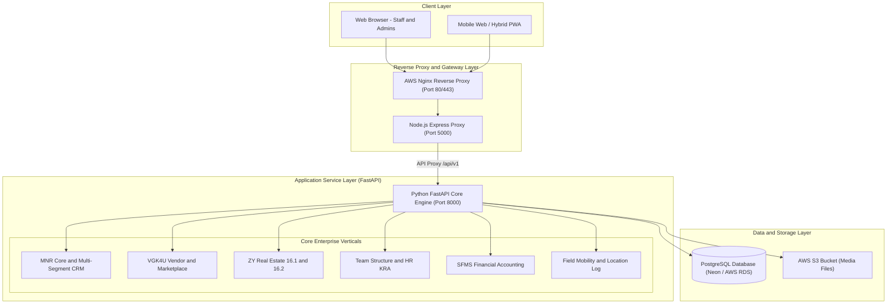

# Master End-to-End System Architecture — Mynt OS (VGK4U / MyntReal Platform)

## 1. High-Level Dual-Stack Architecture Overview
Mynt OS is an enterprise-grade multi-tenant platform orchestrating five primary business verticals: **MNR Core**, **VGK4U Vendor & Enterprise Ecosystem**, **ZY Property Workings (RVZ 16.1)**, **ZY Member Earnings & Incentives (RVZ 16.2)**, and **Team Structures & HR**.

---

## 2. Technical Stack & Process Management

### **Frontend & Gateway Layer (Node.js)**
- **Directory:** `/frontend`
- **Port:** Serves traffic on `5000` (Locally and on Production).
- **Core Functionality:** Serves UI pages, static media, session routing, and proxies all `/api/v1/*` requests to FastAPI on Port 8000.
- **Run Command:** `PORT=5000 node server.js`

### **Backend Core API Layer (Python FastAPI)**
- **Directory:** `/backend`
- **Port:** Listens internally on `8000`.
- **Core Functionality:** Manages database models, business logic across CRM, accounting, incentives, service ticketing, RBAC security, and third-party integrations.
- **Database:** PostgreSQL (Hosted on Neon Cloud / AWS RDS) with SQLAlchemy ORM.
- **Run Command:** `python -m uvicorn app.main:app --host 0.0.0.0 --port 8000 --reload`

---

## 3. Major Enterprise Business Verticals

### **A. MNR (MyntReal Core & Brand Ecosystem)**
- **Segments**: Solar Energy, EV B2B, EV B2C, EV Spares, Real Dreams, Insurance, ETC Training Students.
- **CRM & Analytics**: Executive Dashboard (`/staff/executive-dashboard`), Stagewise trends, period drilldowns.
- **MNR Admin & User**: Income Unified, Awards Management, KYC Management, Withdrawal Supreme, Finance Supreme, Compliance Dashboard, User Dashboard, Downlines & Earnings.

### **B. VGK4U (VGK Enterprise & Vendor Ecosystem)**
- **VGK Team Management**: Members Registry, Income Management, PIN Activation, Promo Codes, Bonanza Campaigns & Claims.
- **Vendor Master & Marketplace**: Vendor Master, Vendor Categories, Vendor Products Marketplace, Transaction Approvals, Wallet & Withdrawals.

### **C. ZY Properties & Member Earnings (RVZ 16.1 & 16.2)**
- **ZY Property Workings (16.1)**: Property Marketplace, Property Amenities, Partner Profiles, Property Handlers, Real Dreams Dashboard (`/rvz/real-dreams-dashboard`).
- **ZY Member Earnings (16.2)**: Incentive Approvals, All VGK4U Members, VGK Real Estate (ZR), VGK Care (ZC).

### **D. Team Structures & HR Management**
- **Employee Hierarchy**: Roles, Departments, Referral Uplines (Telecaller → Field Staff → Guru ID → Senior Handler).
- **HR & Attendance**: In/Out Time, Leaves & Approvals, Attendance Records, Computation.
- **Staff & Promoter NDA**: Staff NDA Versions, Acceptance Audit, Promoter Management, Promo NDA Editor/Audit.
- **KRA System**: KRA Templates, Status Tracking, Review Sheets.

### **E. Financial Ledger & Accounts (SFMS)**
- Double-entry bookkeeping, Party Master, TDS Challans, Expense Subcategories, Cash/Kind vouchers, Inventory BOM, Manufacturing, Stock Transfers, Payroll Profiles & Runs.

---

## 4. Production Deployment (AWS Elastic Beanstalk)

- **Platform:** Amazon Linux 2023 (Docker container).
- **Startup Supervisor:** `start.sh` orchestrates startup: launches Uvicorn on Port 8000 in background, then Node.js on Port 5000 in foreground.
- **Resource Optimization:** Single-worker Uvicorn configuration keeps memory utilization <85% on t2/t3.micro instances.
- **Secure Packaging:** Automated via `zip_for_aws.py`, which injects encrypted environment variables into `.ebextensions/01_env.config` during build.

---

## 5. Architectural Governance Policy
> [!IMPORTANT]
> **Mandatory Policy**: Whenever a new module, schema, API endpoint, or workflow component is modified or added to Mynt OS, this `ARCHITECTURE.md` file and `/ach` presentation page MUST be updated to maintain true synchronization with the active codebase.
