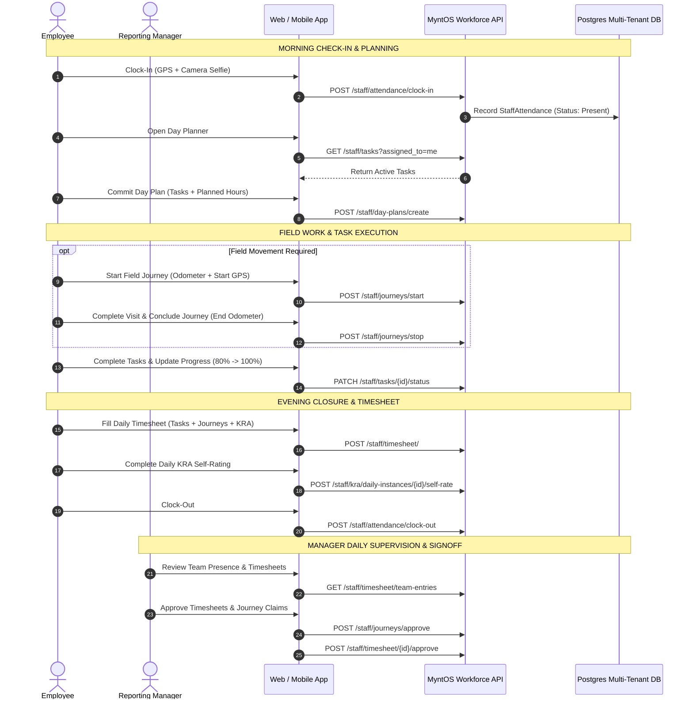
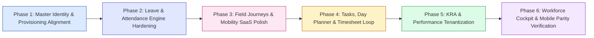

# MYNTOS SAAS WORKFORCE PRODUCT DISCOVERY & ARCHITECTURE ASSESSMENT
**Module Coverage: Tasks + KRA + Timesheet + Attendance + Leave + Journeys + Employee Management**  
**Delivery Representations: Web + /mobile + Android + iOS (Full Parity)**  
**Status: PHASE 0 READ-ONLY DISCOVERY COMPLETE — AWAITING DIRECTIONAL APPROVAL**  
**Date:** September 25, 2026  

---

## 1. Executive Summary & Core Architectural Tenets

This discovery document presents the complete architectural and productization blueprint for transforming MyntOS's internal HRMS/Operations engines into a unified, enterprise-grade **SaaS Workforce Management Platform**.

### 1.1 The Golden Rule: Single Master Employee Identity
In MyntOS SaaS, **ONE Employee Identity (`StaffEmployee`) anchors every workforce domain**:
- Attendance, Leaves, Field Journeys, Tasks, Day Planner, KRA / Daily Metrics, and Timesheets **do not maintain independent employee registries**.
- Every module links directly to `StaffEmployee.id` and validates authorization against `StaffEmployee.base_company_id` / `StaffCompanyMembership.company_id`.
- The multi-tenant context (`RequestContext.company_id` / `tenant_id`) is strictly enforced at every API boundary.

### 1.2 Preservation of Closed Foundations
The following established pillars remain **strictly closed and protected**:
1. **Multi-Tenant Foundation & RequestContext**: Multi-tenant resolution, subdomains, headers, session tokens.
2. **CRM & Workflows Entitlement Engine**: Isolated subscriptions, company memberships, role-based access.
3. **SaaS Service Architecture**: Tickets, SLA tracking, queue routing, priority matrices.
4. **Frozen Telephony Architecture (Rule #6)**: Plivo WebRTC controller, dial callbacks, dual-party call recording.
5. **Mobile Parity Rule (Rule #5)**: Any change in business logic or presentation must reflect identically across Web, `/mobile`, Android, and iOS.

---

## 2. Classification Legend

Each workforce component and capability is evaluated under the following classification scheme:
- **[A] READY / REUSE**: Battle-tested production engine; already supports tenant/company scoping with minimal or no adjustment.
- **[B] NEEDS SAAS PRODUCTIZATION**: Production-grade business logic exists, but hardcoded internal assumptions, system codes, or missing company isolation checks must be cleanly productized.
- **[C] NEEDS FUNCTIONAL FIX**: Feature is functional in backend, but lacks front-end integration, UI wiring, or workflow completeness.
- **[D] NEEDS BUSINESS DECISION**: Policy or operational choices requiring user alignment prior to implementation.
- **[E] NEEDS SCHEMA CHANGE**: Requires non-breaking column additions, foreign keys, or seed data.
- **[F] INTERNAL ONLY / DO NOT EXPOSE**: Internal platform operations, consultant payouts, or legacy tools not suitable for multi-tenant exposure.

---

## 3. Module-by-Module Deep Discovery & Assessment

### Module 1: Master Employee Identity & Management
- **Primary Models**: [`StaffEmployee`](file:///Users/viswanathkari/Documents/Mynt OS/MyntReal_Latest/backend/app/models/staff.py), [`StaffCompanyMembership`](file:///Users/viswanathkari/Documents/Mynt OS/MyntReal_Latest/backend/app/models/staff.py), [`StaffDepartment`](file:///Users/viswanathkari/Documents/Mynt OS/MyntReal_Latest/backend/app/models/staff.py), [`StaffRole`](file:///Users/viswanathkari/Documents/Mynt OS/MyntReal_Latest/backend/app/models/staff.py).
- **Core Endpoints**:
  - `POST /api/v1/platform-b2b/tenant/users`: SaaS Tenant user creation (enforces seat licenses, module entitlements, generates passwords).
  - `GET /api/v1/staff/employees`: Tenant employee directory (scoped to `current_user.company_id`).
  - `POST /api/v1/staff/employees`: Rich HRMS employee creation (departments, manager, probation, designation).
  - `GET /api/v1/staff/employees/{id}`: Detailed employee 360 profile.
- **Classification**: **[B] / [C]**
- **Discovery Findings**:
  1. **Dual Provisioning Discrepancy**: `platform-b2b/tenant/users` manages license quotas and module entitlement validation, but omits HR fields (`department_id`, `reporting_manager_id`, `date_of_joining`). Conversely, `staff/employees` captures HR attributes but lacks seat-quota enforcement.
  2. **Department Multi-Tenancy**: `StaffDepartment` has no `company_id` column (all 8 departments are global/shared).
  3. **Reporting Hierarchy**: `reporting_manager_id` self-references `StaffEmployee.id` within the company. Manager evaluation trees in attendance, leaves, and KRAs work out-of-the-box once assigned.

### Module 2: Attendance & Time Tracking
- **Primary Models**: [`StaffAttendanceSheet`](file:///Users/viswanathkari/Documents/Mynt OS/MyntReal_Latest/backend/app/models/staff_attendance_sheet.py), [`StaffAttendance`](file:///Users/viswanathkari/Documents/Mynt OS/MyntReal_Latest/backend/app/models/staff_attendance.py), [`StaffWorkInterval`](file:///Users/viswanathkari/Documents/Mynt OS/MyntReal_Latest/backend/app/models/staff.py).
- **Core Endpoints**:
  - `POST /api/v1/staff/attendance/clock-in`: Daily clock-in with GPS coords, selfie evidence, address lookup.
  - `POST /api/v1/staff/attendance/clock-out`: End-of-day clock-out with work duration calculation.
  - `POST /api/v1/staff/attendance/break/start` & `end`: Tea/lunch breaks tracking.
  - `GET /api/v1/staff/attendance-sheet`: Monthly company attendance register and manager reconciliation.
  - `GET /api/v1/staff/attendance/today`: Live presence badge for current session.
- **Classification**: **[A]** (Backend Engine) / **[B]** (SaaS Experience)
- **Discovery Findings**:
  1. The attendance tracking engine is exceptionally robust with geofencing, selfie upload, and multi-interval work logs.
  2. The company scoping filter (`company_id = current_user.company_id`) is already implemented across both `staff_time_tracker.py` and `staff_attendance_sheet.py`.
  3. Seamless sync between daily tracking sessions (`StaffAttendance`) and the master monthly reconciliation register (`StaffAttendanceSheet`).

### Module 3: Leave Management
- **Primary Models**: [`StaffLeaveType`](file:///Users/viswanathkari/Documents/Mynt OS/MyntReal_Latest/backend/app/models/staff_attendance_sheet.py), [`StaffLeaveBalance`](file:///Users/viswanathkari/Documents/Mynt OS/MyntReal_Latest/backend/app/models/staff_attendance_sheet.py), [`StaffLeaveRequest`](file:///Users/viswanathkari/Documents/Mynt OS/MyntReal_Latest/backend/app/models/staff_attendance_sheet.py).
- **Core Endpoints**:
  - `GET /api/v1/staff/leaves/leave-types`: List configured leave categories.
  - `GET /api/v1/staff/leaves/my-balance`: Employee's current quota (Casual, Sick, Earned, Unpaid).
  - `POST /api/v1/staff/leaves/apply`: Submit leave request with date range and reason.
  - `GET /api/v1/staff/leaves/pending-approvals/manager`: Manager queue for team leaves.
  - `POST /api/v1/staff/leaves/approve/manager/{id}`: Manager approval / rejection action.
  - `POST /api/v1/staff/leaves/approve/hr/{id}`: Final HR approval step.
- **Classification**: **[E]** (Data Seed) / **[A]** (Logic & Engine)
- **Discovery Findings**:
  1. The underlying multi-tier approval workflow (Manager $\rightarrow$ HR) is fully built.
  2. **Critical Discovery**: `staff_leave_types` table has 0 rows in the dev database. Migration `add_leave_management_tables_20260107.sql` defines standard leave types (`casual_leave`, `sick_leave`, `approved_leave`, `unpaid_leave`), but standard system seed data must be ensured across all tenant environments.

### Module 4: Field Journeys & Mobility
- **Primary Models**: [`StaffJourney`](file:///Users/viswanathkari/Documents/Mynt OS/MyntReal_Latest/backend/app/models/staff_journey.py), [`StaffJourneyTrackPoint`](file:///Users/viswanathkari/Documents/Mynt OS/MyntReal_Latest/backend/app/models/staff_journey.py), [`StaffJourneyApproval`](file:///Users/viswanathkari/Documents/Mynt OS/MyntReal_Latest/backend/app/models/staff_journey.py).
- **Core Endpoints**:
  - `POST /api/v1/staff/journeys/start`: Start travel session (vehicle type, start odometer photo, start GPS).
  - `POST /api/v1/staff/journeys/checkpoint`: Mid-route GPS location tracking point.
  - `POST /api/v1/staff/journeys/stop`: Conclude trip (end odometer photo, calculated distance, auto-calculated reimbursement).
  - `GET /api/v1/staff/journeys/all`: Manager/Admin trip register for approval.
  - `POST /api/v1/staff/journeys/approve`: Reimbursement approval endpoint.
- **Classification**: **[A]**
- **Discovery Findings**:
  1. Links cleanly to `attendance_id`, `lead_id`, and `task_id` for auditable client visits.
  2. Distance calculation and rate per km (`StaffTransportRate`) operate smoothly.
  3. Already enforces `company_id` tenant scoping across all route endpoints.

### Module 5: Task Management & Day Planner
- **Primary Models**: [`StaffTask`](file:///Users/viswanathkari/Documents/Mynt OS/MyntReal_Latest/backend/app/models/staff_tasks.py), [`StaffTaskAssignee`](file:///Users/viswanathkari/Documents/Mynt OS/MyntReal_Latest/backend/app/models/staff_tasks.py), [`StaffDayPlan`](file:///Users/viswanathkari/Documents/Mynt OS/MyntReal_Latest/backend/app/models/staff_day_plans.py), [`StaffDayPlanItem`](file:///Users/viswanathkari/Documents/Mynt OS/MyntReal_Latest/backend/app/models/staff_day_plans.py).
- **Core Endpoints**:
  - `GET /api/v1/staff/tasks`: Filtered list of company tasks (by assignee, status, priority, category).
  - `POST /api/v1/staff/tasks`: Create tasks with assignees, due dates, checklists, and attachments.
  - `PATCH /api/v1/staff/tasks/{id}/status`: Progress tracking (`pending` $\rightarrow$ `in_progress` $\rightarrow$ `completed`).
  - `POST /api/v1/staff/tasks/{id}/comments`: Task discussion timeline.
  - `POST /api/v1/staff/day-plans/create` & `/eod-submit`: Morning day-planning and EOD reconciliation.
- **Classification**: **[B]** / **[E]**
- **Discovery Findings**:
  1. Tasks connect seamlessly with Day Plans: `StaffDayPlanItem.task_id` allows employees to pull assigned tasks into their daily plan.
  2. `StaffTask` currently derives tenant isolation through the creator/assignee's `StaffEmployee.base_company_id`. Adding an explicit `company_id` column to `staff_tasks` will harden isolation and optimize indexing.

### Module 6: KRA & Performance Management
- **Primary Models**: [`StaffKRATemplate`](file:///Users/viswanathkari/Documents/Mynt OS/MyntReal_Latest/backend/app/models/staff_kra.py), [`StaffKRAAssignment`](file:///Users/viswanathkari/Documents/Mynt OS/MyntReal_Latest/backend/app/models/staff_kra.py), [`StaffKRADailyInstance`](file:///Users/viswanathkari/Documents/Mynt OS/MyntReal_Latest/backend/app/models/staff_kra.py).
- **Core Endpoints**:
  - `GET /api/v1/staff/kra/templates`: Master metric templates (KPI definitions, weightages, target frequencies).
  - `POST /api/v1/staff/kra/assignments`: Assign KRA template to employee with designated manager.
  - `GET /api/v1/staff/kra/daily-instances/today`: Daily scoring sheet for active employees.
  - `POST /api/v1/staff/kra/daily-instances/{id}/self-rate`: Daily employee self-assessment.
  - `POST /api/v1/staff/kra/daily-instances/{id}/manager-review`: Daily/periodic manager evaluation and rating.
- **Classification**: **[B]** (Template Approval Policy) / **[A]** (Daily Evaluation Engine)
- **Discovery Findings**:
  1. The template assignment and daily scoring engines are rich and field-tested.
  2. **Internal Assumption Gap**: In `staff_kra.py`, KRA template publishing check enforces `role_code == 'vgk4u'`! In SaaS mode, tenant admins (`role_code == 'tenant_admin'` or `role_code == 'admin'`) must be permitted to approve and publish company KRA templates.

### Module 7: Timesheets
- **Primary Models**: [`StaffTimesheetEntry`](file:///Users/viswanathkari/Documents/Mynt OS/MyntReal_Latest/backend/app/models/staff_timesheet.py).
- **Core Endpoints**:
  - `GET /api/v1/staff/timesheet/my-entries/{date}`: Retrieve daily time allocation blocks.
  - `POST /api/v1/staff/timesheet/`: Log time against Tasks, KRAs, Leads, or Journeys.
  - `GET /api/v1/staff/timesheet/team-entries`: Manager dashboard of billable/operational hours.
  - `POST /api/v1/staff/timesheet/{id}/approve`: Manager signoff on logged hours.
  - `GET /api/v1/staff/timesheet/computation`: Comparison of Attendance Clock Hours vs. Timesheet Logged Hours.
- **Classification**: **[A]**
- **Discovery Findings**:
  1. Timesheet entries directly capture `task_id`, `kra_id`, `lead_id`, and `journey_id`, closing the operational loop.
  2. The computation engine reconciles clocked attendance hours against productive timesheet logs.

### Module 8: Workforce Cockpit & Executive Dashboard
- **Primary Models**: Aggregation across Attendance, Day Plans, Tasks, Journeys, and Leave balances.
- **Existing Endpoints**:
  - `GET /api/v1/staff/snapshot/overview` (Operations snapshot).
  - `GET /api/v1/staff/attendance/summary`.
- **Classification**: **[B]**
- **Discovery Findings**:
  1. Currently, `/api/v1/staff/snapshot/overview` is restricted via `_is_key_leadership(current_user)` (internal hardcoded role check), returning `403 Forbidden` for SaaS tenant administrators.
  2. SaaS tenants require a dedicated, tenant-scoped **Workforce Cockpit** providing executive presence, today's field count, pending approvals, and SLA alerts.

---

## 4. End-to-End Workflow Architecture

### 4.1 Master Entity & Dependency Map
```mermaid
graph TD
    subgraph Master Identity
        TE[Tenant / Company] --> SE[StaffEmployee]
        SE --> SD[StaffDepartment]
        SE --> SR[StaffRole]
        SE --> RM[Reporting Manager Hierarchy]
    end

    subgraph Operational Loops
        SE --> ATT[StaffAttendance]
        ATT --> DP[StaffDayPlan]
        DP --> TSK[StaffTask]
        SE --> JRN[StaffJourney]
        SE --> KRA[StaffKRAAssignment]
        KRA --> KRI[StaffKRADailyInstance]
    end

    subgraph Accounting & Verification
        TSK --> TS[StaffTimesheetEntry]
        JRN --> TS
        KRI --> TS
        TS --> RECON[Hours Reconciliation]
        ATT --> RECON
        SE --> LV[StaffLeaveRequest]
        LV --> ATT
    end

    style Master Identity fill:#e0f2fe,stroke:#0284c7
    style Operational Loops fill:#fef3c7,stroke:#d97706
    style Accounting & Verification fill:#dcfce7,stroke:#16a34a
```

### 4.2 The Daily Employee Operating Lifecycle


---

## 5. Web, Mobile, Android & iOS Parity Matrix

In compliance with **Rule #5 (Full Platform Parity)**, all capabilities exist in Web and `/mobile` (and therefore Android/iOS native wrappers via Capacitor):

| Capability / Screen | Web Frontend (`frontend/`) | Mobile App (`mobile/src/pages/`) | Platform Parity Status |
| :--- | :--- | :--- | :--- |
| **Employee Directory** | `staff_employees.html` | `StaffEmployeesPage.ts` | Complete |
| **Employee 360 Profile** | `staff_employees.html` (Modal) | `StaffDirectoryPage.ts` | Complete |
| **Tenant User Quotas** | `staff_tenant_users.html` | Under Drawer $\rightarrow$ Settings | Needs aligned link |
| **Daily Clock-In/Out** | `staff_my_attendance.html` | `StaffAttendanceSheetPage.ts` | Complete (GPS + Photo) |
| **Team Attendance** | `staff_team_attendance.html` | `TeamAttendancePage.ts` | Complete |
| **Attendance Sheet Register** | `staff_attendance_sheet.html` | `StaffAttendanceSheetPage.ts` | Complete |
| **Leave Application & Balance**| `staff_my_leaves.html` | `LeavesPage.ts` | Complete |
| **Leave Approval Queue** | `staff_leave_approvals.html` | `StaffLeaveApprovalsPage.ts` | Complete |
| **Field Journeys & Tracking** | `staff_my_journeys.html` | `JourneysPage.ts` | Complete |
| **Team Journey Approvals** | `staff_all_journeys.html` | `StaffAllJourneysPage.ts` | Complete |
| **Day Planner** | `staff_day_planner.html` | `DayPlannerPage.ts` | Complete |
| **Task Management** | `staff_task_tracker.html` | `TasksPage.ts` / `TaskDetailPage.ts`| Complete |
| **KRA Templates** | `staff_kra_templates.html` | `StaffKRATemplatesPage.ts` | Complete |
| **Daily KRA Self-Rating** | `staff_my_kras.html` | `KRAsPage.ts` | Complete |
| **KRA Manager Reviews** | `staff_kra_review.html` | `StaffKRAReviewPage.ts` | Complete |
| **Daily Timesheet Entry** | `staff_my_timesheet.html` | `TimesheetPage.ts` | Complete |
| **Timesheet Approvals** | `staff_timesheet_approval.html`| `StaffTimesheetApprovalPage.ts` | Complete |
| **Workforce Executive Cockpit**| `staff_executive_dashboard.html`| `ExecutiveDashboardPage.ts` | Needs SaaS Tenant Enablement |

---

## 6. Duplicate / Competing Engines Analysis & Resolution

| Candidate Engine A | Candidate Engine B | Conflict / Overlap Analysis | Strategic Resolution |
| :--- | :--- | :--- | :--- |
| `platform_b2b:create_tenant_user` | `staff_employees:create_employee` | Dual employee creation points. `platform_b2b` checks seat limit and hashes login passwords, but lacks HR metadata. `staff_employees` allows HR editing but skips subscription limits. | **Single Unified Flow**: Standardize employee creation so that `platform-b2b` user provisioning automatically seeds `StaffEmployee` with full HR fields (reporting manager, department, joining date), or delegate employee creation to `staff/employees` with seat limit checks. |
| `staff_attendance` (Daily) | `staff_attendance_sheets` (Monthly) | Potential confusion over which table holds true presence. | **Complimentary Architecture**: `staff_attendance` captures real-time clock-in/out timestamps and intervals; a nightly trigger or end-of-day clock-out event reconciles the day into `staff_attendance_sheets` for monthly payroll auditing. |
| `staff_tasks` | `staff_day_plans` | Whether day planning is an isolated task tracker. | **Unified Synergy**: Day Planner items directly reference `task_id`. Day Planner is simply the daily prioritization layer over the company's task backlog. |
| Global Departments | Multi-Tenant Departments | `staff_departments` lacks `company_id`. | Add nullable `company_id` to `staff_departments` to allow company-specific custom departments while retaining standard shared defaults. |

---

## 7. Gaps, Missing Pieces & Technical Debt

### 7.1 Identified Functional & Authorization Gaps
1. **KRA Template Approval Role Restriction**:
   - `staff_kra.py` requires internal `role_code == 'vgk4u'` for KRA template approval.
   - *Fix*: Update permission check to permit `current_user.role_code in ['vgk4u', 'tenant_admin', 'admin']` scoped to `current_user.company_id`.
2. **Operations Snapshot Authorization**:
   - `/api/v1/staff/snapshot/overview` is restricted to internal `_is_key_leadership`.
   - *Fix*: Allow company administrators to view their own company-scoped workforce overview.
3. **Empty Master Data (`staff_leave_types`) in Dev DB**:
   - Table `staff_leave_types` contains 0 rows in the dev database.
   - *Fix*: Execute initial seed script for default leave types (`Casual Leave`, `Sick Leave`, `Privilege Leave`, `Unpaid Leave`).
4. **Company ID on Tasks**:
   - `staff_tasks` currently infers tenancy via `created_by` / `primary_assignee_id`.
   - *Fix*: Add explicit `company_id` column with index to `staff_tasks` for bulletproof multi-tenant isolation.

---

## 8. Business Decisions Required Prior to Implementation [D]

The following questions are submitted for user confirmation:
1. **Department Model**: Should SaaS tenants only select from predefined standard departments (Operations, Sales, Engineering, Support, HR, Finance), or should they be able to create company-custom departments?
2. **Leave Balance Policy**: Should new employees automatically receive standard annual leave quotas upon provisioning (e.g. 12 Casual, 12 Sick), or does HR manually allocate leave balances?
3. **Task Multi-Company Visibility**: Confirm that tasks assigned by a manager are visible exclusively to staff holding membership in that exact company.
4. **Workforce Dashboard Role Access**: Confirm that the executive workforce dashboard is accessible to `tenant_admin` and `manager` roles, with employees seeing their personal daily progress view.

---

## 9. Recommended Phased Implementation Sequence

Following approval of this discovery, implementation should proceed in controlled, risk-mitigated phases:



- **Phase 1: Master Identity & Provisioning Alignment**
  - Unify `platform-b2b` tenant user creation with `StaffEmployee` HR metadata (reporting manager, department, date of joining).
  - Add `company_id` support for custom tenant departments.
- **Phase 2: Attendance & Leave Engine Hardening**
  - Seed master leave types and ensure automated baseline balance allocation.
  - Verify attendance clock-in/out and reconciliation pipeline for multi-tenant companies.
- **Phase 3: Field Journeys & Mobility**
  - Validate GPS trip recording, odometer evidence, and manager reimbursement approval.
- **Phase 4: Tasks, Day Planner & Timesheets**
  - Add explicit `company_id` to `staff_tasks`.
  - Connect Day Planner $\leftrightarrow$ Tasks $\leftrightarrow$ Timesheet reconciliation loop.
- **Phase 5: KRA & Performance Tenantization**
  - Unlock KRA template approval for `tenant_admin`.
  - Test daily self-rating and manager appraisal flow.
- **Phase 6: Workforce Cockpit, Parity Verification & Final Gate**
  - Enable company-scoped Executive Workforce Cockpit.
  - Run end-to-end multi-platform verification across Web, `/mobile`, Android, and iOS.

---

## 10. Strict Phase 0 Mandate & Current Status

In strict adherence to instructions:
- **Phase 0 is Read-Only Discovery Only**.
- No application code, database schema, or production records have been mutated.
- The system is standing by for user directional approval of this discovery before initiating Phase 1.
